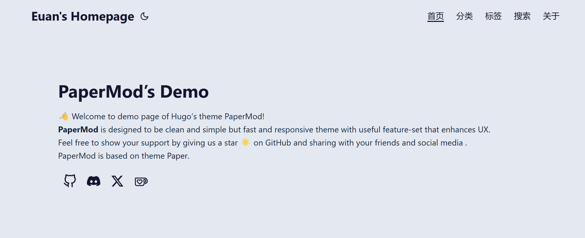

## 前言
- 前期在网上搜索搭建个人网站，热度高的帖子教程都显示得非常简洁，主打“快速建站，毫不费力”。实际体验下来的感受是，如果你只是需要在网站上发布一些简单的文章，那么直接用模板还是很便捷的。但如果你希望在其中加入个性化的设置，那么对于零编程基础的人来说，门槛还是很高的。

- 但是好在Hugo建站和papermod这个主题模板的热度比较高，所以有很多非常优秀的案例和教程可以学习。

## 教程：
- 主题模板：[hugo-PaperMod](https://github.com/adityatelange/hugo-PaperMod)

- 全局搭建教程：
  - [Hugo + PaperMod + Github Pages 搭建一个完善的个人博客(以 Windows11 为例)](https://sonnycalcr.github.io/posts/build-a-blog-using-hugo-papermod-github-pages/)

  - 作者的全程讲解视频（B站）：BV1pRYPetEWy

- 补充资料：[PaperMod侧边目录](https://github.com/arashsm79/hugo-PaperMod-Mod) ；这位作者的目录是放置在右侧的，所以我结合自己的习惯，调整成放置在界面左侧

- 说明：因为我没有编程基础，所以代码的修改是依靠chatgpt与通义千问，导致我的css文件内容会有重复定义等情况出现，内容稍显杂乱，代码体验不是太好。

## 主要变更
- Light模式下的主题背景、字体颜色变更及相应的模块跟随变更；

- 主界面显示尺寸及缩略图尺寸变更；

- 详情页面加入左侧目录，正文放置在右侧；

## 没能处理好的部分
- 不知道如何正确定义类名，我希望给“分类”、“标签”、“搜索”和“关于”界面改成居中显示，但是因为类名无法区分，导致在custom.css文件中指定的特定格式都没有应用，统一跟随了.main的格式。
- 跟随教程给详情页定义了class类名，但是上传到网页后，html的审查元素中并没有显示我定义的类名，所以目前有几个界面是左侧顶格状态。

## 网页首页截图
